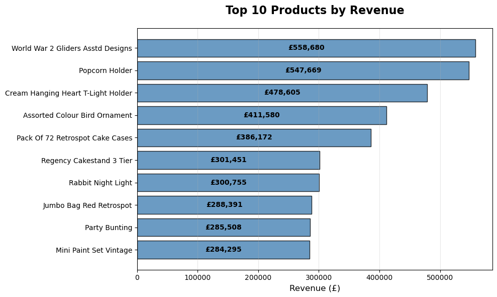
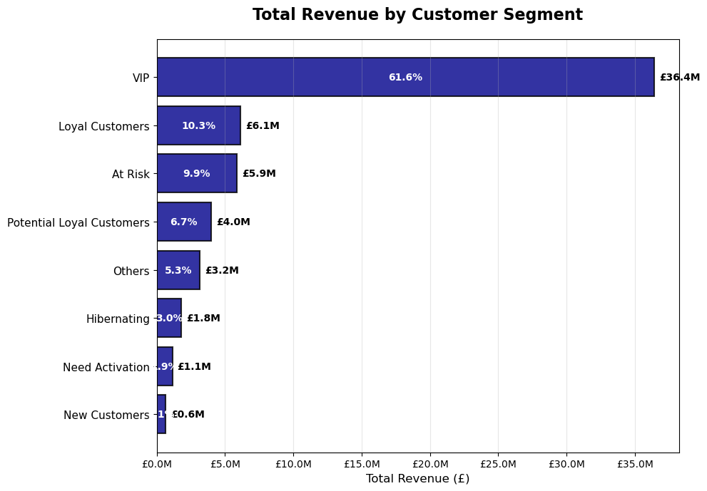

# E-commerce Sales Transactions Analysis

A comprehensive analysis of e-commerce transaction data to uncover customer behavior patterns, product performance insights, and business optimization opportunities.

## Project Summary
This project analyzes a year of UK e-commerce transactions to uncover customer behavior, product trends, and opportunities for business growth. Using data cleaning, customer segmentation (RFM), cohort analysis, and market basket analysis, we reveal key drivers of revenue, retention, and product associations. 

## Project Structure

### Table of Contents
1. **[ Dataset](#dataset)** - Data source
2. **[ Data Processing](#data-processing)** - Cleaning and feature engineering
3. **[ Exploratory Data Analysis](#exploratory-data-analysis-eda)** - Key insights and patterns
4. **[ Customer Segmentation](#customer-segmentation)** - RFM Analysis and Pareto Principle
5. **[ Customer Retention Analysis](#customer-retention-analysis)** - Cohort analysis
6. **[ Market Basket Analysis](#market-basket-analysis)** - Product associations rules and cross-selling
7. **[ Business Recommendations](#business-recommendations)** - Actionable insights and strategies
8. **[ Future Enhancements](#future-enhancements)** - Next steps and improvements

## Dataset 

This is a sales transaction data set of UK-based e-commerce (online retail) for one year. This London-based shop has been selling gifts and homewares for adults and children through the website since 2007. 
- *Source*: https://www.kaggle.com/datasets/gabrielramos87/an-online-shop-business

## Data Processing
1. **Data Cleaning**: Removed duplicates, handled missing values, filtered cancelled transactions
2. **Feature Engineering**: Created revenue calculations, date components and metrics for visualisations
3. **Create Categories**: Created categories using regex patterns 

## Exploratory Data Analysis (EDA)

### Key insights
- **Total Revenue**: £59,127,353
- **Geographic Concentration**: UK represents 82.8% of total revenue
- **Seasonal Patterns**: November shows peak performance
- **Customer Behavior**: Sunday emerges as the highest revenue day
- **Transaction Volume**: Average of 272 items per transaction indicates bulk purchasing
- **Most Customers buy bulk** (70% of customers buy more than 100 products per order on average)
### Bulk vs Retail Customers

- **Retail Customers** : 1377 (AVG Quantity Per Transaction <= 100)

- **Bulk Customers** : 3282 (AVG Quantity Per Transaction > 100)

### Top Revenue Generators

- **Top 10 Products by Revenue**

- **Monthly Revenue** (Removed December because the dataset did not contain the whole month)

- **Product Categories by Revenue**

- **Top Countries by Revenue**

## Customer Segmentation

### RFM Analysis
Customers were segmented using RFM analysis (Recency, Frequency, Monetary) to identify distinct behavioral groups:

- **VIP Customers**: High-value, frequent, recent purchasers
- **Loyal Customers**: Consistent engagement and spending
- **At Risk**: Previously valuable customers showing declining activity
- **New Customers**: Recent acquisitions

- **Customer Segments by Revenue**

### Revenue Distribution
- **Pareto Principle** 28.3% of customers generate 80% of total revenue
- **Top 3 segments** generate 81.9% of total revenue
- **VIP segment** alone contributes 61.6% of revenue

## Customer Retention Analysis 

### Cohort Analysis
**Cohort analysis groups customers by the month they first made a purchase and tracks how many return in later months. This helps measure monthly customer retention and spot seasonal patterns**

#### Retention Insights
**We don't include the first month in our cohort analysis because our dataset only covers one full year.**
**Including the first month would give incomplete retention results, since we can't track earlier activity or repeat purchases from before the dataset starts.**

**First Month Dropoff:**
   - Average first-month retention: 20.4%

**Top 3 months for retention :**
   - September: 24.4%
   - October: 23.4%
   - April: 20.6%

**Bottom 3 months for retention :**
   - June: 17.6%
   - July: 14.8%
   - March: 14.1%
  
#### Insights
- **We can recognize a big dropoff on the first month which probably correlates to the fact that most customers buy bulk.**
- **We can see a clear seasonal pattern of customer retention:**
    - Summer months seem to be the worst for retention due to the holiday season (June, July).
    - Retention increases from September, likely with the start of the academic year. 

## Market Basket Analysis

**Market basket analysis looks at customer purchase data to find out which products are often bought together.**

### Key metrics

- **Support:**  measures how common is the pairing of products A and B
- **Confidence:** measures how likely is product B bought when product A is bought
- **Lift:** measures how much does product A boost the chances of product B being bought compared to random

**Highlights**

- **Transactions with multiple items:** 17487 | 92.4% of total transactions
- **Average basket size**: 26.2 items

**Top 5 Product Associations (by Lift):**

- Herb Marker Thyme&nbsp;&nbsp;&nbsp;&nbsp;&nbsp;&nbsp;      → Herb Marker Rosemary | Lift: 71.00 | Conf: 93.4%
- Herb Marker Rosemary&nbsp;&nbsp;→ Herb Marker Thyme | Lift: 71.00 | Conf: 93.0%
- Herb Marker Chives&nbsp;&nbsp;&nbsp;&nbsp;&nbsp;&nbsp;→ Herb Marker Parsley | Lift: 70.88 | Conf: 92.4%
- Herb Marker Chives&nbsp;&nbsp;&nbsp;&nbsp;&nbsp;&nbsp;→ Herb Marker Thyme | Lift: 69.79 | Conf: 91.4%
- Regency Tea Plate Pink&nbsp;&nbsp;→ Regency Tea Plate Green | Lift: 43.73 | Conf: 91.2%

**Top 5 Product Associations (by Support):**
- Jumbo Bag Red Retrospot&nbsp;&nbsp;&nbsp;&nbsp;&nbsp;&nbsp;&nbsp;&nbsp;&nbsp;&nbsp;&nbsp;&nbsp;→ Jumbo Bag Pink Polkadot | Support: 4.66% | Count: 805
- Jumbo Bag Pink Polkadot&nbsp;&nbsp;&nbsp;&nbsp;&nbsp;&nbsp;&nbsp;&nbsp;&nbsp;&nbsp;&nbsp;&nbsp;→ Jumbo Bag Red Retrospot | Support: 4.66% | Count: 805
- Roses Regency Teacup And Saucer&nbsp;→ Green Regency Teacup And Saucer | Support: 4.26% | Count: 736
- Green Regency Teacup And Saucer&nbsp;→ Roses Regency Teacup And Saucer | Support: 4.26% | Count: 736
- Jumbo Bag Red Retrospot&nbsp;&nbsp;&nbsp;&nbsp;&nbsp;&nbsp;&nbsp;&nbsp;&nbsp;&nbsp;&nbsp;&nbsp;→ Jumbo Storage Bag Suki | Support: 4.05% | Count: 699
## Business Recommendations

1. **Customer Engagement**: 
- Launch targeted retention campaigns for "At Risk" customers
- Offer exclusive deals or perks to VIP customers to encourage loyalty
2. **Product Bundling**: 
- Develop and promote bundles featuring top-performing product pairs identified through market basket analysis
3. **Market Expansion**: 
- Explore marketing strategies and tailored offers for high-potential European countries to diversify revenue streams
4. **Seasonal Planning**: 
- Align inventory and promotions with peak sales periods (e.g., November)
- Scale back marketing spend and inventory during low-activity summer months to control costs

## Future Enhancements
- **Advanced Category Creation**: Create product categories using NLP
- **Predictive Modeling**: Predict customer value and churn
- **Real-time Analytics**: Add interactive dashboards for performance monitoring
- **Advanced Segmentation**: Machine learning algorithms for clustering or classification 

## Requirements

- **Prerequisites**: Python 3.7+
- **Installation**: `pip install requirements.txt`